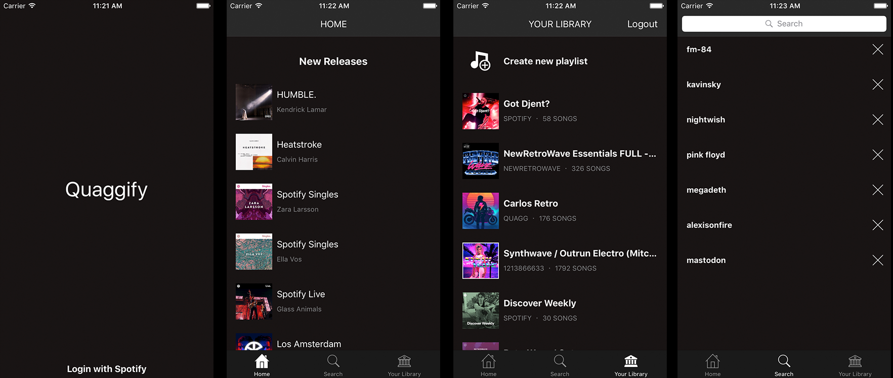
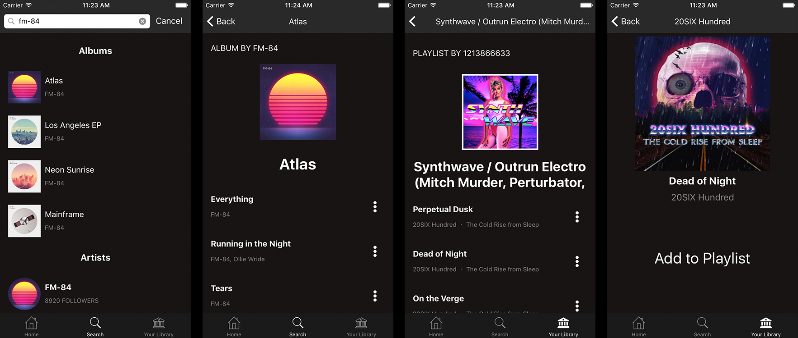

# Quaggify
A Spotify clone made in Swift 3 and consuming the Spotify API.




## What can the app do?

- Login with your Spotify account
- Home tab lists all new releases
- Search for an album/artist/track/playlist
- Create new playlist
- Modify your current playlists
- Add/Remove tracks from your playlists
- Infinite scroll everything!

## Dependencies
Cocoapods was the chosen dependency manager

- [Alamofire](https://github.com/Alamofire/Alamofire) Networking
- [ObjectMapper](https://github.com/Hearst-DD/ObjectMapper) JSON mapping
- [AlamofireObjectMapper](https://github.com/tristanhimmelman/AlamofireObjectMapper) Simplifying the model layer
- [ReachabilitySwift](https://github.com/ashleymills/Reachability.swift) Internet connection verification
- [Kingfisher](https://github.com/onevcat/Kingfisher) Loading images from the server

## Building

### Clone the repository
```
$ git clone https://github.com/Quaggie/Quaggify.git
```

### Build the dependencies
```
$ pod install
```

### Setup your spotify CLIENT_ID and CLIENT_SECRET in SpotifyService.swift
``` swift
...
class SpotifyService: NSObject {
  let CLIENT_ID = "{ INSERT CLIENT_ID HERE }"
  let CLIENT_SECRET = "{ INSERT CLIENT_SECRET HERE }"
  let REDIRECT_URI = "quaggify://authorization"
...
```

Now just run `Quaggify.xcworkspace` (:
